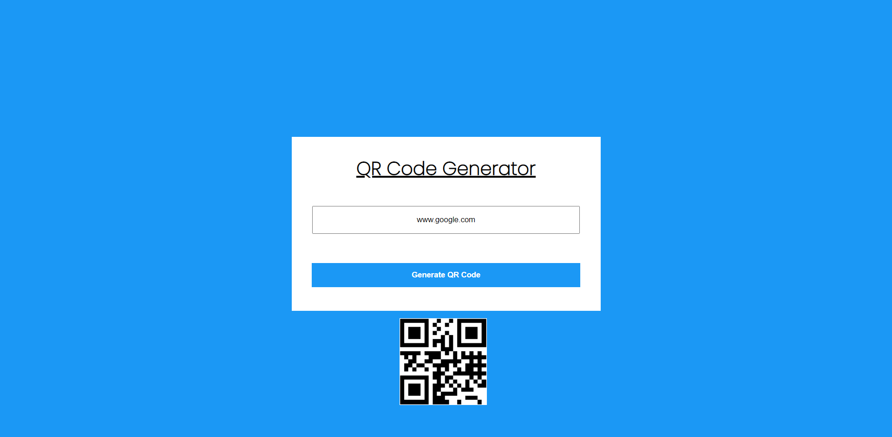

# Description
This is a simple QR code generator created using an api called api.qrserver. We can enter any text data in the input box and a QR code will be generated for it.

## Time Taken

1 hour approximately

[Live Demo](https://jokegen-akj.netlify.app/)

### SnapShot of the program

